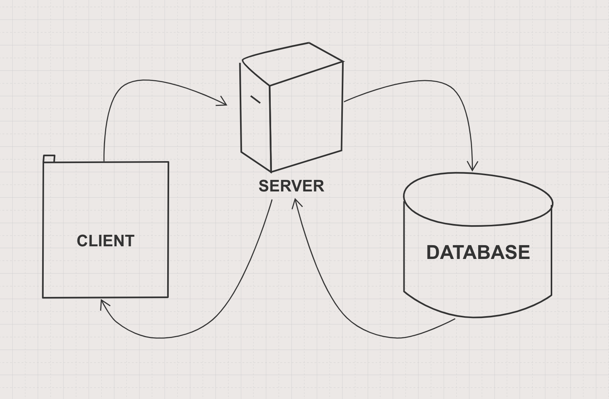

As a user,
I want to see a list of bookmarks
So that I am able to know what I need to look at today

As a user
I want to be able to add to a record of bookmarks
So that I am able to return to websites that I have enjoyed

As a user
I want to be able to delete a bookmark
So that I can manage my list

As a user
I want to be able to update a bookmark
So that I can keep my list up-to-date




### To set up the database
Connect to `psql` and create the `bookmark_manager` database:
```
CREATE DATABASE bookmark_manager;
```
To set up the appropriate tables, connect to the database in `psql` and run the SQL scripts in the `db/migrations` folder in the given order.

### To set up the test database
Connect to `psql` and create the `bookmark_manager_test` database:
```
CREATE DATABASE bookmark_manager_test;
```
To set up the appropriate tables, connect to the database in `psql` and run the SQL scripts in the `db/migrations/01_create_bookmarks_table.sql`.
